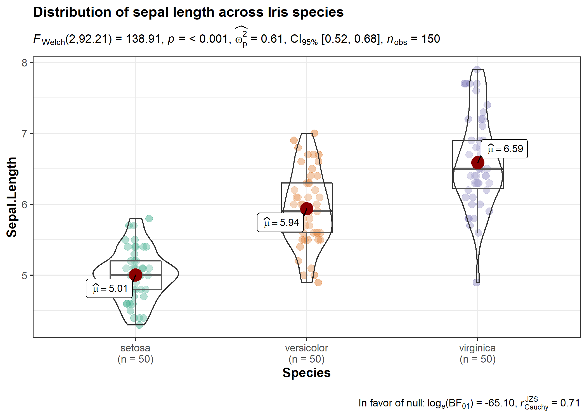

# 고양시 공공자전거 스테이션 최적 위치 선정

## 개요 
### 배경
- 고양시는 2010년부터 공공자전거 서비스(피프틴, https://www.fifteenlife.com)를 도입하여
약 161개 스테이션(자전거 보관소)과 1,700여대의 공공자전거로 시민들에게 서비스를 제공 중에 있습니다.

- 현재 고양시는 신규 택지개발 등으로 도시화 지역이 늘어나고
인구 증가 등으로 인하여 기존 스테이션 위치에 대한 조정이 필요합니다.

### 목적
- 공공자전거 운영이력 데이터 및 공간 데이터를 활용하여 자전거 스테이션의 최적 위치를 선정하여
향후 시민들의 공공자전거(공유자전거) 사용에 대한 접근성을 개선하고자 합니다.

### 해결 과제
- 고양시에 대하여 공공자전거 스테이션의 최적위치를 제시하여 주시기 바랍니다.
- 분석 조건
    + 스테이션의 개수는 최대 300개소
    + 스테이션별 자전거 수용 용량 최대 30대

### 참고
- 지식 자료실 / [공간분석 활용](https://compas.lh.or.kr/gis)의 COMPAS 게시물들을 참조하여 도움을 얻을 수 있습니다.

### 주관 대회 사이트 
- [compas](https://compas.lh.or.kr/) 

# Table 작성
- 함수의 `설명서`는 아래와 같습니다. 

| function | Plot | Description |
|-|-|-|
| ggbarstats | violin plots | for comparisons between groups |
| ggcorrmat | correlation matrices | for correlations between multiple variables  |

# 소스코드 입력
- 터미널 bash 코드 입력 예제

```shell script
$ python -m pip install -U pip
$ python -m pip install -U matplotlib
```

```python
import pandas as pd
```

```r
library(ggplot2)
library(dplyr)
```

# 그림파일 예제
- 다음은 그림파일 예제입니다. 

```r
# loading needed libraries
library(ggstatsplot)

# for reproducibility
set.seed(123)

# plot
ggstatsplot::ggbetweenstats(
  data = iris,
  x = Species,
  y = Sepal.Length,
  title = "Distribution of sepal length across Iris species"
)
```

